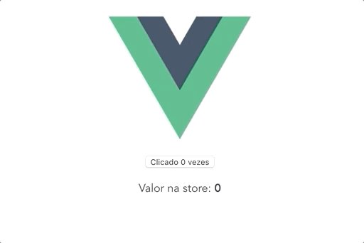

# plugin-button



Este pacote precisa do VUEX instalando no seu projeto para poder funcionar.

Para instalar
```js
npm i plugin-button

yarn add plugin-button
```

Para usar
```js
import Vue from 'vue'
import store from './store.js';

import SimpleButton from 'plugin-button';
Vue.use(SimpleButton, { store })


new Vue({
  store,
  render: h => h(App),
}).$mount('#app')
```
